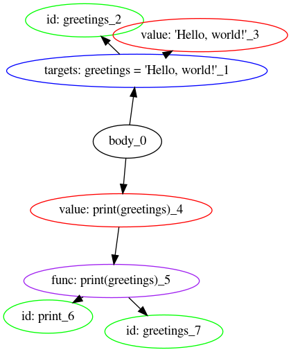
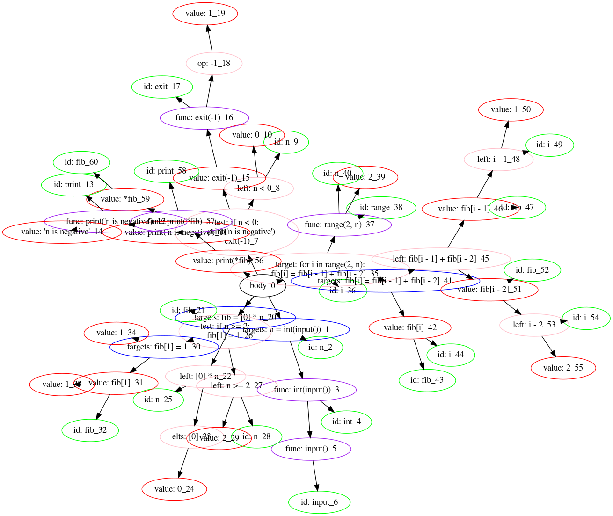

# AST visualizer

This is an AST builder package for python programs. It can draw an AST graph in pretty format.

Example for simple program

Example for program which calculates fibonacci sequence

# Usage

You need install [this](https://test.pypi.org/project/ast-builder-package-DenisovNikita/) package. Then import function `draw_pretty_ast` and just call it! Function requires single parameter: a path to file with python script.
